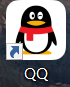

# Html_JS_CSS_Study
前端学习

1.VSCode**安装**：选择附加任务部分全部勾选、

**2.VSCode扩展：**

Chinese(Simplified)：汉化

HTML CSS support：写CSS代码快捷神器

Live Server:实时预览页面变化效果

Auto Rename Tag：在修改HTML标签的时候，同步修改与之匹配的另一个标签(即修改开始标签，结束标签也自动修改)

**3.HTML**

超文本标记语言：通过一系列标签来定义哪些是标题，哪些是段落，哪些列表，哪些是图像等等

标签成对出现的，双标签：包括开始和结束标签，内容则位于开始标签和结束标签之内。用于有内容的元素。

```html
<P>这是一个段落</P>
<h1>
    这是一个一级标题
</h1>
<a href="#">这是一个超链接</a>
```

单标签:用于**没有内容的元素**。

```html
<input type="text">
<br> 换行标签
<hr> 分隔线标签
```

**HTML文件结构**

```html
<!DOCTYPYE html> 告诉浏览器这是一个HTML文件
<html>
	<head> 文档的头部：包含了文档元信息
        <title>文档标题</title>
        <meta chatset="UTF-8"> 文档编码格式
        <!-- 连接外部样式表成脚本文件等-->
        <link rel="stylesheet" type="text/css" href="styles.css">
        <script src="script.js"></script>
    </head>
    <body> 显示在浏览器页面的内容，文本图像联接等
		<h1>
            这是一级标题
        </h1>        
        <p>
            这是一个段落
        </p>
        <a href="https//www.example.com">这是一个链接</a>
    </body>
</html>
```

**快捷**打开：进入C:\Users\48467\Desktop\Html_JS_CSS_Study，输入cmd,再输入code .就可以打开该项目的vscode

在vscode中手动搭建html骨架太耗费时间，我们可以在首行输入！，然后选择！，再tab就可生成html文档结构

预览html，代码空白处鼠标右键，open wiht live server,就可以在浏览器中预览页面效果

**HTML属性**

```html
<!DOCTYPE html>
<html lang="en">
<head>
    <meta charset="UTF-8">
    <meta name="viewport" content="width=device-width, initial-scale=1.0">
    <title>Html 属性</title>
</head>
<body>
    <!-- a标签常用于链接到其他网页或者位置 -->
     <!-- href定义了链接的目标：可以是网页的URL或者文件的路径或者电子邮箱地址或者手机号等等 -->
    <a href="https://docs.geeksman.com">这是一个超链接1</a>
    <!-- target的值：在新窗口打开标签，在当前网页打开标签，在... -->
    <a href="https://www.baidu.com" target="_blank">这是一个超链接2</a>
    <!-- <br> 换行标签 -->
     <br>
    <a href="https://www.baidu.com" target="_parent">这是一个超链接3</a>
    <!-- <hr> 换行并创建水平分割线 -->
    <a href="https://www.baidu.com" target="_self">这是一个超链接4</a>
    <hr>
    <a href="https://www.baidu.com" target="_top">这是一个超链接5</a>
    <!-- img标签的src定义了图片要显示的URL或者文件路径,alt(如果图像加载不出来)定义图像的替代文本 -->
    
    <hr>
    
    <hr>
    
</body>
</html>
```


每个标签都可以有一个或者多个属性：用于描述元素的行为外观以及和其他元素的关系

```
基本语法
<开始标签 属性名="属性值">  这里可以是单引号或者双引号
```

每个html元素可有不同的属性

```html
<p id="describe" class="section"> 这是一个段落标签</p>
<a href="https://www.sample.com"> 这是一个超链接</a>
```

属性名称不区分大小写，属性值对大小写敏感

```html
 src表示图片标签的路径


12相同，3不同
```

大部分标签都可以使用的属性

```
class:为html元素定义一个或者多个类名（类名从样式文件引入）
id:定义元素唯一的id
style：规定元素的行内样式
```

```html
<!DOCTYPE html>
<html lang="en">
<head>
    <meta charset="UTF-8">
    <meta name="viewport" content="width=device-width, initial-scale=1.0">
    <title>html中常见文本标签练习</title>
</head>
<!-- 主要代码在body中写 -->
<body>
    <!-- 1.标题标签 -->
    <h1>1</h1>
    <h2>2</h2>
    <h3>3</h3>
    <h4>4</h4>
    <h5>5</h5>
    <h6>6</h6>
    <!-- 2.段落标签 -->
    <p>段落一</p>
    <p>更改文本样式，
        <b>加粗方式1</b>
        <strong>加粗方式2</strong>
        <i>斜体</i>
        <u>下划线</u>
        <s>删除线</s>
    </p>
    <p>改变字体大小需要用到css</p>
    <!-- 无序标签 -->
    <ul>
        <li>无序列表元素1</li>
        <li>无序列表元素2</li>
        <li>无序列表元素3</li>
        <li>无序列表元素4</li>
        <li>shift+alt+向下箭头：复制行快捷键</li>

    </ul>
    <!-- 有序标签 -->
    <ol>
        <li>有序列表元素1</li>
        <li>有序列表元素2</li>
        <li>有序列表元素3</li>
        <li>有序列表元素4</li>
        <li>shift+alt+向下箭头：复制行快捷键</li>
    </ol>
    <!-- 表格标签 -->
    <!-- 给表格加上边框 -->
    <table border="3">
        <!-- 表格中的一行tr：table row -->
        <tr>
            <!-- 列标题th:table header -->
            <th>列标题1</th>
            <th>列标题2</th>
            <th>列标题3</th>
        </tr>
        <tr>
            <!-- 表格中的一格td:tabel data -->
            <td>元素1</td>
            <td>元素2</td>
            <td>元素3</td>
        </tr>
        <tr>
            <!-- 表格中的一格td:tabel data -->
            <td>元素4</td>
            <td>元素5</td>
            <td>元素6</td>
        </tr>
        <tr>
            <!-- 表格中的一格td:tabel data -->
            <td>元素7</td>
            <td>元素8</td>
            <td>元素9</td>
        </tr>
    </table>
</body>
</html>
```


HTML 区块-块元素与行内元素

```
块元素用于组织和布局页面的主要结构和内容，段落标题列表表格等。
通常从新行开始，占据整行的快读，页面呈现为一块独立的内容快
可以包含其他块级元素和行内元素
常见的块级元素div p h1~h6 ul ol li table form等

行内元素用于添加文本样式或为文本中的一部分应用样式
通常在同一行呈现，不会独占一行
只占据其内容所需宽度，而不是整行的宽度
行内元素不能包含块级元素，但可以包含其他行内元素
常见行内元素 span a strong em img br input
```

创建div块的快捷方式，div可以替换成其他元素比如h1,h2等

```html
.liuxinjie或者div.liuxinjie回车 得到
<div class="liuxinjie"></div>

#liuxinjie或者div#liuxinjie 回车 得到
<div id="liuxinjie"></div>
创建div块初始附带id快捷键 
```

```html
<!DOCTYPE html>
<html lang="en">

<head>
    <meta charset="UTF-8">
    <meta name="viewport" content="width=device-width, initial-scale=1.0">
    <title>Html 区块</title>
</head>

<body>
    <!-- 第一个div块是导航栏 -->
    <div class="nav">
        <!-- 无任何语义,仅用于组织内容,创建页面布局 -->
        <!-- href="#"表示不跳转 -->
        <a href="#">链接1</a>
        <a href="#">链接2</a>
        <a href="#">链接3</a>
        <a href="#">链接4</a>
        <a href="#">链接5</a>
    </div>
    <!-- 第二个,接下来内容部分用另一个div标签包裹 -->
    <div class="content">
        <h1>文章标题</h1>
        <p>段落一</p>
        <p>段落二</p>
        <p>段落三</p>
        <p>段落四</p>
    </div>
    <!-- span相当于没有特殊元素的a标签和img标签,主要将一小部分文本包装起来,以便于对他们使用样式\CSS或者JS行为 -->
    <!-- 即包装文本图片等,在JS和CSS里面装饰他们 -->
    <!-- 本身没有语义，不表示标题、段落、列表等具体意义。
它是一个纯粹的容器，用来包裹文本或其他行内元素，方便添加样式（CSS）或绑定事件（JavaScript） -->
    <span>链接点击这里<a href="#">链接</a></span>
    <!-- 总结:div用于创建块级容器以便于组织页面的结构和布局,span标签用于内联样式化文本,给文本的一部分应用样式或者标记 -->
</body>

</html>
```


4.HTML表单

创建一个表单和创建一个表格差不多

```html
<!DOCTYPE html>
<html lang="en">

<head>
    <meta charset="UTF-8">
    <meta name="viewport" content="width=device-width, initial-scale=1.0">
    <title>4.html表单</title>
</head>

<body>
    <!-- 这里action填写url,下面的submit提交表单form中的所有数据到对应的url-API接口,#表示不跳转占个位置而已 -->
    <form action="#">
        <!-- 用span标签代替label也可，label是只能用于input标签 -->
        <!-- <span>账户：</span> -->
         <label for="username">账户：</label>
        <input type="text" id="username" placeholder="请输入用户名">
        <br>
        <label for="passwd">密码：</label>
        <input type="password" id="passwd" placeholder="请输入密码">
        <br>

        <!-- 单选框 -->
         <!-- for属性用于将其绑定到input中的id元素，你点击对应的label就可以跳转到对应的input输入框 -->
         <label for="">性别</label>
        <!-- 这里加个name属性表示归类，如果不加那么三个单选框分别表示三类，那么都可以选中；归类后只能选择该类的一项 -->
         <input type="radio" name="gender"> 男
         <input type="radio" name="gender"> 女
         <input type="radio" name="gender"> 其他

         <!-- 多选框 -->
         <br>
         <label for="">爱好：</label>
         <input type="checkbox" name="hobby" id=""> 唱
         <input type="checkbox" name="hobby" id=""> 跳
         <input type="checkbox" name="hobby" id=""> rap
         <input type="checkbox" name="hobby" id=""> 篮球

         <br>
        <input type="submit",value="上传">
    </form>

</body>

</html>
```


5.CSS 层叠样式表

```
选择器{
	属性1：属性值;
	属性2：属性值;
}
1.选择器：要应用样式的html元素，标签，特定类，特定id等，可以写无数条属性；
```

导入方式：

内部样式表：把css样式放在html文档的head标签中style包裹

```html
<!DOCTYPE html>
<html lang="en">
<head>
    <meta charset="UTF-8">
    <meta name="viewport" content="width=device-width, initial-scale=1.0">
    <title>5.css导入方式</title>
    <link rel="stylesheet" href="./css/style.css">
    <style>
        p {
            color:blue;
            font-size: large;
        }
        h2{
            color: green;
        }
    </style>
</head>
<body>
    <!-- 1.内部样式表（html的head里的style模块） -->
    <p>这是一个使用1.内部样式表文本段落</p>
    <h2>二级标题：使用1.内部样式表</h2>
    <!-- 2.内联样式（标签中的style属性值） -->
     <h1 style="color: red;">一级标题：使用2.内联样式</h1>
    <!-- 3.外部样式表（单独css文件，然后在html的head标签中使用link标签把css链接到html中） -->
    <h3>3.外部样式表</h3>
</body>
</html>
```

三种常见css导入方式的**优先级**：内联样式（标签中的style属性值）>内部样式表（html的head里的style模块）>外部样式表（单独css文件，然后在html的head标签中使用link标签把css链接到html中）

这里的优先级就是一个范围的问题：内部的私有的肯定比公共的高，优先使用

选择器：元素、**类、ID**、通用、子元素、后代(包含)、并集（兄弟）、伪类选择器

选择器也有优先级：id>类>标签名

```html
<!DOCTYPE html>
<html lang="en">
<head>
    <meta charset="UTF-8">
    <meta name="viewport" content="width=device-width, initial-scale=1.0">
    <title>CSS选择器</title>
    <style>
        /* 1元素选择器：直接写标签名即可 */
        h2{
            color: aqua;
        }
        h3{
            color: green;
        }
        /* 2类选择器 */
        .liuxinjie{
            background-color: blanchedalmond;
        }
        /* 3id选择器 */
        #liuxinjie2{
            color: red;
        }
        /* 4通用选择器，给所有元素添加样式 */
        *{
            font-family:'Times New Roman', Times, serif;
            font-weight: bolder;
        }
        /* 5子元素选择器：选择位于这个父元素内部的子元素 */
        /* 父元素和子元素：类比文件夹和文件的关系 */
        /* 只包含儿子，不包含孙子 */
        .father>p{
            color: yellowgreen;
        }
        /* 6后代选择器，包含儿子和孙子 */
        .father p{
            color: brown;
        }
        /* 7.兄弟选择器：相邻元素选择器,紧跟h3之后的一个p标签有效 */
        h3+p{
            background-color: cyan;
        }
        /* 8.伪类选择器，选择html文档元素的特定状态或者位置。比如鼠标悬停元素上，会出现特定的状态 */
        #liuxinjie4:hover{
            background-color: blueviolet;
        }
        /* 9.伪元素选择器 
        ::after选中元素之后插入虚拟内容
        ：：before选择元素之前插入虚拟内容 */

    </style>
</head>
<body>
    <h1>不同类型的css选择器</h1>
    <h2>元素选择器示例</h2>
    <h3 class="liuxinjie">类选择器：与普通区分，通过类特殊化样式</h3>
    <h3>普通h3标题，应用普遍样式</h3>
    <h4 id="liuxinjie2">四级标题，应用id选择器</h4>
    <div class="father">
        <p class="son">这是一个子元素选择器示例</p>
        <div>
            <p class="grandson">这是一个后代选择器示例</p>
        </div>
    </div>
    <p>这是一个普通的段落</p>
    <h3>这是一个相邻兄弟选择器示例</h3>
    <p>这是另一个普通段落</p>

    <h3 id="liuxinjie4">这是一个伪类选择器示例</h3>
</body>
</html>
```


《3小时前端入门教程》进度123456789集


# 代码编辑快捷键

1.快速移动光标到行首Fn+⬅

2.从当前位置快速选中到行首Fn+shift+⬅

3.光标快速移动到文档开头ctrl Fn ⬅

4.上一个单词的开头ctrl ⬅

5.在上一行添加一个光标ctrl alt ⬆

6.CTRL G，输入行号可以跳转到目标行

7.Ctrl + Shift + P打开命令面板

**重启编辑器**，（更新插件、修改配置后），输入 reload window

窗口 & 编辑器管理

| 功能           | 搜索关键词（命令面板） | 说明                |
| -------------- | ---------------------- | ------------------- |
| 重新加载窗口   | `reload`               | 相当于重启 VS Code  |
| 打开设置（UI） | `settings`             | 打开可视化设置界面  |
| 打开快捷键配置 | `keyboard`             | 修改键盘快捷键      |
| 切换侧边栏显示 | `toggle sidebar`       | 显示/隐藏左侧工具栏 |
| 显示/隐藏终端  | `toggle terminal`      | 打开/关闭内置终端   |
| 关闭所有编辑器 | `close all`            | 关闭所有标签页      |

文件 & 项目

| 功能               | 搜索关键词       | 说明                       |
| ------------------ | ---------------- | -------------------------- |
| 新建文件           | `new file`       | 创建新文件                 |
| 打开文件           | `open file`      | 选择并打开文件             |
| 保存所有文件       | `save all`       | 保存全部更改               |
| 重新打开已关闭文件 | `reopen closed`  | 类似浏览器“恢复关闭标签”   |
| 打开最近文件/项目  | `recent`         | 快速进入最近使用过的内容   |
| 文件比较           | `compare active` | 当前文件与其他文件比较差异 |

开发者工具

| 功能                   | 搜索关键词        | 说明                                 |
| ---------------------- | ----------------- | ------------------------------------ |
| 重新加载窗口（开发者） | `reload`          | 同 Reload Window                     |
| 开发者工具             | `developer tools` | 打开调试面板（类似 Chrome DevTools） |
| 按键提示模式           | `screencast`      | 显示按键提示，录教程时好用           |

8.按文件名快速打开 ctrl  p

9.注释/取消注释（块）Shift + Alt + A

10.新建文件 Ctrl + N

11.格式化代码 shift alt f

12.打开终端 ctrl `

13.关闭当前文件 CTRL w;关闭IDE CTRL shift w

14.


